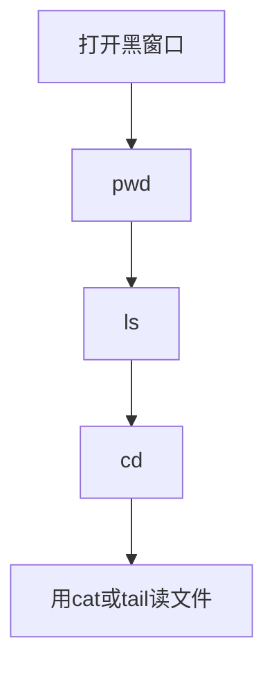

# 测试常用 Linux 命令（从零开始）

## 一句话

Linux 命令是你在黑窗口里打的一句话。电脑按这句话做事。测试用它去服务器上看文件。

## 类比

像去一栋没有鼠标、只有对讲机的大楼。你说话。大楼里的人帮你开门、找房间、读墙上的纸。

## 拆解

- 解决什么问题：测试服务器常常没有图标和鼠标。你只能打字。打字才能看日志。
- 为什么需要：日志是程序写下的工作记录。测试要自己打开这份记录。不会打字，就只能等别人帮你看。

## 对照

先只记这四步。一步只会一件事。

| | 定义 | 作用 | 何时出现 | 何时用 | 例子 |
| --- | --- | --- | --- | --- | --- |
| pwd | 问电脑：我现在在哪个文件夹 | 告诉你当前位置 | 你刚打开窗口，或刚换过文件夹 | 迷路了，先问自己在哪 | 打 `pwd`，回车 |
| ls | 列出当前文件夹里有什么 | 给你看文件名和文件夹名 | 你要找某个文件 | 先看这里有没有日志文件 | 打 `ls`，回车 |
| cd | 走进另一个文件夹 | 换位置 | 日志不在当前文件夹 | 文件在别的房间里 | `cd 文件夹名` |
| cat / tail | 把文件内容显示出来 | 让你读文件 | 你已经找到日志文件 | 读短文件用 cat；读长文件末尾用 tail | `cat a.log` `tail a.log` |

## 图

## 何时用

- 用：你第一次上测试服务器。你要找一个文件。你要读日志。
- 不用：你还不会这四步，就不要先背 ssh、curl、ps。那些是后一步。

## 误区

- 新手：把命令当成要一次背完的单词表。命令是工具。先会走路：问位置、看房间、进房间、读纸。
- 面试：一上来讲端口和进程。面试官问基础时，先说：文件夹、文件、pwd、ls、cd、看日志。

## 面试 30 秒

Linux 测试机常常没有鼠标。我打开一个黑窗口。我打命令。`pwd` 告诉我在哪个文件夹。`ls` 列出这里有什么。`cd` 让我进另一个文件夹。找到日志后，我用 `cat` 或 `tail` 读它。这是最基础的四步。别的命令都建立在这四步上面。

## 口诀

先问在哪，再看有什么，走进去，再读文件。
