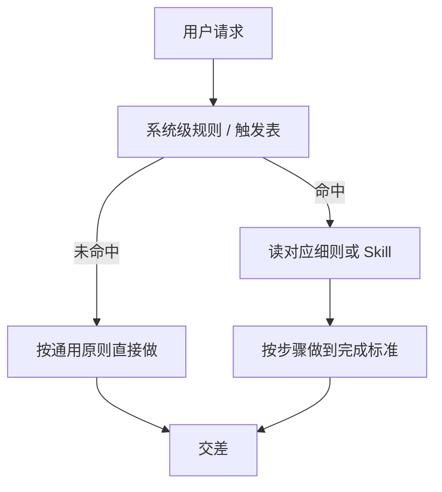

# 系统级规则、Skill、一次任务流程

## 一句话

规则决定什么时候读哪份文件；Skill 是某类任务的做法；一次任务流程就是这次具体怎么走完。

## 类比

- 系统级规则：公司门口的告示牌，写清「什么情况去哪个房间」。
- Skill：某个房间里的操作手册，只在进这个房间后才打开。
- 一次任务流程：你今天办这件事实际走过的路线，不是第三套文件。

## 拆解

- 解决什么问题：模型每轮都会读常驻规则。细节越多，越容易在不相关的任务里抢注意力。所以把「何时读什么」和「某类任务怎么做」拆开。
- 为什么需要分开：常驻规则只放开关和原则；测试、识图、写卡片这类专项步骤放进 Skill 或触发表后面的细则，用到再读。

## 对照

| | 定义 | 作用 | 何时出现 | 何时用 | 例子 |
| --- | --- | --- | --- | --- | --- |
| 系统级规则 | `AGENTS.md` 里每轮都在的红线 | 决定要不要读某份材料，以及通用怎么问、怎么改代码 | 每个对话一开始 | 跨项目都成立的约束 | 触发表、不擅自假设、代码只写够用的 |
| Skill | 某类任务的步骤和完成标准 | 告诉模型这类活按什么顺序做、做到什么算完 | 用户点名，或 description 命中 | 重复出现的专项能力 | 诊断缺陷、知识卡片、禅道 CSV |
| 一次任务流程 | 这一次请求实际执行的路径 | 把规则和 Skill 串成这一趟 | 只在当前任务里 | 不单独写成第三份常驻文档 | 命中测试触发表 → 读 `测试规则.md` → 按内层表读细则 → 交差 |

## 图

## 何时用

- 用：要讲清「常驻规则、专项 Skill、这一趟怎么走」各自管什么；要解释为什么测试细则不写进 `AGENTS.md`。
- 不用：正在写代码或跑测试时，不要为了分层理论再展开一张卡片。

## 误区

- 新手：以为 Workflow 是和规则、Skill 并列的第三个文件。在本系统里没有这份文件，流程就是触发表加上当前 Skill 的步骤。
- 面试：把 Skill 说成「更长的规则」。Skill 是有完成标准的做法；规则是开关和红线。把所有细则都做成 Skill，等于每轮多交一份常驻目录，专项步骤却不一定被读到。

## 面试 30 秒

系统级规则是每轮都在的红线，只写跨项目约束和「什么任务去读哪份材料」。Skill 是某一类任务的操作手册，点名或命中才打开，里面是步骤和完成标准。一次任务怎么走，是规则把你领到材料或 Skill 之后，实际执行的那条路径，不是再维护一套 Workflow 文档。

## 口诀

规则管开关，Skill 管做法，流程是这一趟。
